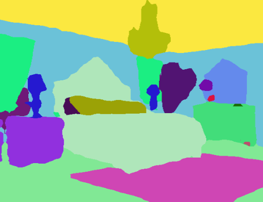
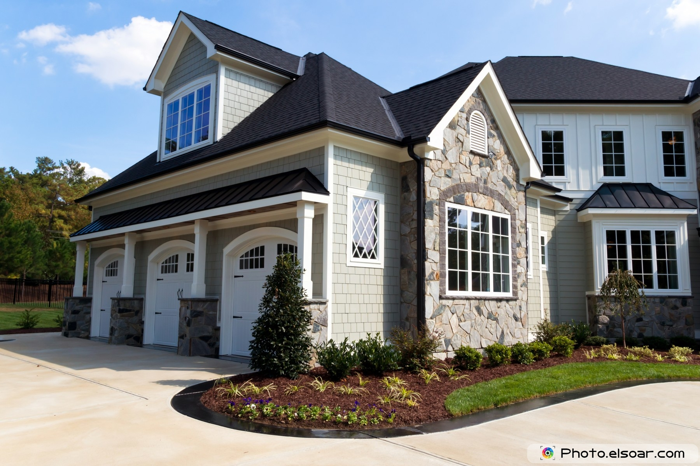

# Image Segmentation Keras : Implementation of Segnet, FCN, UNet, PSPNet and other models in Keras.


Implementation of various Deep Image Segmentation models in keras.

<p align="center">
  
</p>

## Working Google Colab Examples:
* Python Interface: https://colab.research.google.com/drive/1q_eCYEzKxixpCKH1YDsLnsvgxl92ORcv?usp=sharing
* CLI Interface: https://colab.research.google.com/drive/1Kpy4QGFZ2ZHm69mPfkmLSUes8kj6Bjyi?usp=sharing


## Our Other Repositories
- [Attention based Language Translation in Keras](https://github.com/divamgupta/attention-translation-keras)
- [Ladder Network in Keras](https://github.com/divamgupta/ladder_network_keras)  model achives 98% test accuracy on MNIST with just 100 labeled examples

### Top Contributors

* [Divam Gupta](https://divamgupta.com) [](https://twitter.com/divamgupta)
* [Rounaq Jhunjhunu wala](https://github.com/rjalfa)
* [Marius Juston](https://github.com/Marius-Juston)
* [JaledMC](https://github.com/JaledMC)

## Models

Following models are supported:

| model_name       | Base Model        | Segmentation Model |
|------------------|-------------------|--------------------|
| fcn_8            | Vanilla CNN       | FCN8               |
| fcn_32           | Vanilla CNN       | FCN8               |
| fcn_8_vgg        | VGG 16            | FCN8               |
| fcn_32_vgg       | VGG 16            | FCN32              |
| fcn_8_resnet50   | Resnet-50         | FCN32              |
| fcn_32_resnet50  | Resnet-50         | FCN32              |
| fcn_8_mobilenet  | MobileNet         | FCN32              |
| fcn_32_mobilenet | MobileNet         | FCN32              |
| pspnet           | Vanilla CNN       | PSPNet             |
| vgg_pspnet       | VGG 16            | PSPNet             |
| resnet50_pspnet  | Resnet-50         | PSPNet             |
| unet_mini        | Vanilla Mini CNN  | U-Net              |
| unet             | Vanilla CNN       | U-Net              |
| vgg_unet         | VGG 16            | U-Net              |
| resnet50_unet    | Resnet-50         | U-Net              |
| mobilenet_unet   | MobileNet         | U-Net              |
| segnet           | Vanilla CNN       | Segnet             |
| vgg_segnet       | VGG 16            | Segnet             |
| resnet50_segnet  | Resnet-50         | Segnet             |
| mobilenet_segnet | MobileNet         | Segnet             |


Example results for the pre-trained models provided :

Input Image            |  Output Segmentation Image
:-------------------------:|:-------------------------:
  |  
  |  


## Getting Started

### Prerequisites

* Keras ( recommended version : 2.4.3 )
* OpenCV for Python
* Tensorflow ( recommended  version : 2.4.1 )

```shell
apt-get install -y libsm6 libxext6 libxrender-dev
pip install opencv-python
```

### Installing

Install the module

Recommended way:
```shell
pip install --upgrade git+https://github.com/divamgupta/image-segmentation-keras
```

### or 

```shell
pip install keras-segmentation
```

### or

```shell
git clone https://github.com/divamgupta/image-segmentation-keras
cd image-segmentation-keras
python setup.py install
```


## Pre-trained models:
```python
from keras_segmentation.pretrained import pspnet_50_ADE_20K , pspnet_101_cityscapes, pspnet_101_voc12

model = pspnet_50_ADE_20K() # load the pretrained model trained on ADE20k dataset

model = pspnet_101_cityscapes() # load the pretrained model trained on Cityscapes dataset

model = pspnet_101_voc12() # load the pretrained model trained on Pascal VOC 2012 dataset

# load any of the 3 pretrained models

out = model.predict_segmentation(
    inp="input_image.jpg",
    out_fname="out.png"
)

```


### Preparing the data for training

You need to make two folders

*  Images Folder - For all the training images
* Annotations Folder - For the corresponding ground truth segmentation images

The filenames of the annotation images should be same as the filenames of the RGB images.

The size of the annotation image for the corresponding RGB image should be same.

For each pixel in the RGB image, the class label of that pixel in the annotation image would be the value of the blue pixel.

Example code to generate annotation images :

```python
import cv2
import numpy as np

ann_img = np.zeros((30,30,3)).astype('uint8')
ann_img[ 3 , 4 ] = 1 # this would set the label of pixel 3,4 as 1

cv2.imwrite( "ann_1.png" ,ann_img )
```

Only use bmp or png format for the annotation images.

## Download the sample prepared dataset

Download and extract the following:

https://drive.google.com/file/d/0B0d9ZiqAgFkiOHR1NTJhWVJMNEU/view?usp=sharing

You will get a folder named dataset1/


